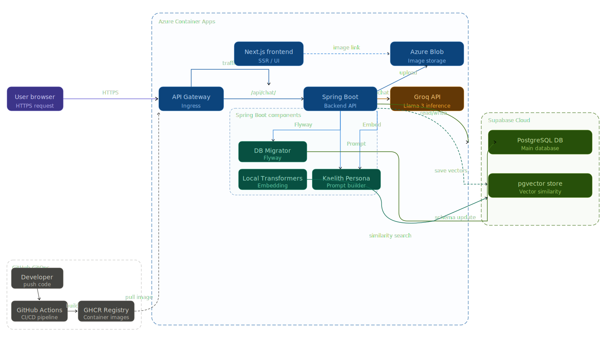

# Sandbox

โปรเจกต์นี้เป็น sandbox สำหรับลองฟีเจอร์หลายแบบในสถาปัตยกรรมแบบ microservice โดยแยก concern ระหว่าง frontend, backend service และ data layer ให้ชัด เพื่อใช้ทดลอง flow จริงตั้งแต่ login, dashboard, chat กับ AI ไปจนถึงการเชื่อมต่อ Supabase



## จุดประสงค์ของโปรเจกต์

- ทดลองออกแบบระบบแบบ microservice แม้ขนาดโปรเจกต์ยังเล็ก
- ทดลอง frontend dashboard ด้วย Next.js + Ant Design
- ทดลอง authentication ด้วย Supabase OAuth
- ทดลอง backend API ด้วย Spring Boot + JPA
- ทดลอง AI chat flow ผ่าน Spring AI และ provider ที่เปิด OpenAI-compatible API
- ทดลอง object storage ผ่าน Supabase Storage

## สถาปัตยกรรมโดยรวม

ระบบถูกแบ่งเป็น 4 ส่วนหลัก

1. `frontend/`
   Next.js App Router สำหรับ UI, route protection, theme, breadcrumb และเรียก backend ผ่าน Axios

2. `backend/chat/`
   Spring Boot service สำหรับ chat history, AI response และ report/upload image

3. `backend/dinner/`
   Spring Boot service สำหรับ supplier order dashboard

4. `database/`
   SQL สำหรับ schema ตัวอย่างของโดเมน `chat` และ `dinner`

> หมายเหตุ: ใน repo มีโฟลเดอร์ `backend/dinner/chat/` ที่เป็นชุดไฟล์ซ้ำอีกชุดหนึ่ง ปัจจุบันเอกสารนี้อ้างอิง service หลักจาก `backend/chat/` และ `backend/dinner/`

## Tech Stack

- Frontend: Next.js 15, React 19, TypeScript, Ant Design, Tailwind, Axios
- Auth: Supabase Auth (OAuth)
- Backend: Spring Boot 3, Spring Data JPA, Spring AI
- AI: OpenAI-compatible endpoint ผ่าน `spring.ai.openai.*` และตั้งค่า base URL ไปที่ Groq
- Database: PostgreSQL บน Supabase
- File Storage: Supabase Storage
- Build/Runtime: Dockerfile แยก frontend และ backend แต่ละ service

## Service Boundary

### 1. Frontend

หน้าที่หลัก

- แสดง UI ทั้งระบบ
- ตรวจ session ด้วย Supabase
- redirect ผู้ใช้ที่ยังไม่ login ไป `/login`
- เรียก backend API ผ่าน `NEXT_PUBLIC_API_URL`
- มี context กลางสำหรับ theme, notification, loading และ breadcrumb

หน้าใช้งานหลักในปัจจุบัน

- `/login` สำหรับ OAuth login
- `/` หน้า home
- `/profile` หน้า profile จาก Supabase session

ส่วนของระบบย่อย (ตามโครงสร้าง Sidebar ใหม่) มีกลุ่มการทำงานหลัก ดังนี้:
- **B-Post (บล็อกและโซเชียล):** `/b-post/blog`, `/b-post/socials`, `/b-post/messages`
- **Dinner (ระบบสั่งอาหารซัพพลายเออร์):** `/dinner/supplier`
- **Chat App (คุยกับ AI):** `/chat-app/message`, `/chat-app/social`

*(บางหน้าอาจจะยังเป็น placeholder รอการพัฒนาในอนาคต)*

### 2. Chat Service

รับผิดชอบ

- ดึงประวัติแชตตาม room
- รับข้อความจาก user
- บันทึกข้อความลงฐานข้อมูล
- โหลด system prompt จากตาราง `chat.ai_context`
- ส่ง prompt ไปหาโมเดล AI
- บันทึกคำตอบของ AI กลับลงฐานข้อมูล

endpoint หลัก

- `GET /v1/api/chat/history/{roomId}`
- `POST /v1/api/chat`

request สำหรับ chat

```json
{
  "roomId": 1,
  "senderId": 1,
  "message": "Hello"
}
```

response

```json
{
  "reply": "..."
}
```

### 3. Dinner Service

รับผิดชอบ

- อ่านข้อมูล supplier order จาก schema `dinner`
- ทำ pagination จาก query parameter
- ส่งผลลัพธ์กลับในรูป `PageResponse`

endpoint หลัก

- `GET /v1/api/supplier-order/inquiry?page=1&size=10`

response จะอยู่ในรูป

```json
{
  "content": [],
  "page": 1,
  "size": 10,
  "totalElements": 0,
  "totalPages": 0
}
```

### 4. Report / Storage Flow

ใน backend มี API สำหรับอัปโหลดไฟล์ภาพขึ้น Supabase Storage

- `POST /v1/api/report/upload-image`

flow นี้มีอยู่ฝั่ง backend แล้ว แต่ frontend ยังไม่ได้เชื่อมต่อจริงครบทั้งหน้าใช้งาน

## End-to-End Flow

### Flow 1: Login และการกัน route

1. ผู้ใช้เข้า `/login`
2. frontend เรียก `supabase.auth.signInWithOAuth(...)`
3. Supabase redirect กลับมาที่ `/auth/callback`
4. route callback แลก code เป็น session
5. `middleware.ts` ตรวจ user จาก cookie/session
6. ถ้ายังไม่ login และพยายามเข้า route ที่ protected จะถูก redirect ไป `/login`
7. หลัง login แล้ว หน้า `/profile` จะแสดงข้อมูลจาก Supabase session โดยตรง

### Flow 2: Supplier Dashboard

1. ผู้ใช้เปิด `/dinner/supplier`
2. หน้า React เรียก `GET /v1/api/supplier-order/inquiry`
3. `SupplierOrderController` รับ pagination request
4. `SupplierOrderService` เรียก native query จาก `SupplierRepository`
5. backend join ตาราง `dinner.suppliers` กับ `dinner.orders`
6. frontend แสดงผลเป็น table, filter, search และ stat card

สิ่งที่ทดลองใน flow นี้

- server pagination
- frontend filtering บนข้อมูลที่อยู่ใน page ปัจจุบัน
- reusable API utility
- notification/loading state

### Flow 3: AI Chat

1. ผู้ใช้เปิด `/chat-app/message`
2. frontend โหลด history ด้วย `GET /v1/api/chat/history/1`
3. backend อ่านข้อความใน room และ map เป็น DTO
4. เมื่อผู้ใช้ส่งข้อความ frontend ยิง `POST /v1/api/chat`
5. backend validate `roomId` และ `senderId`
6. backend บันทึกข้อความของ user ลงตาราง `chat.messages`
7. backend หา AI user หรือสร้างใหม่ถ้ายังไม่มี
8. backend โหลด system prompt จาก `chat.ai_context`
9. backend รวม system prompt + chat history ทั้งห้องเป็น prompt เดียว
10. backend เรียก AI model ผ่าน Spring AI
11. backend บันทึกข้อความตอบกลับของ AI ลงฐานข้อมูล
12. frontend แสดง reply ในหน้าจอ chat

สิ่งที่ทดลองใน flow นี้

- conversational history
- system prompt จากฐานข้อมูล
- AI integration แบบ backend-driven
- persistence ของข้อความในห้องสนทนา

### Flow 4: Image Upload

1. client ส่ง multipart file ไปที่ `/v1/api/report/upload-image`
2. backend สร้างชื่อไฟล์ใหม่ด้วย UUID
3. backend ใช้ service role key ยิง REST ไป Supabase Storage
4. backend ส่งไฟล์กลับเป็น `ByteArrayResource`

flow นี้เป็น sandbox สำหรับทดลอง storage integration มากกว่าจะเป็น feature ที่ผูกกับ UI หลักในตอนนี้

## โครงสร้างโฟลเดอร์

```text
Sandbox/
|- frontend/                 Next.js app
|- backend/
|  |- chat/                  Chat + report/upload service
|  |- dinner/                Supplier order service
|  \- dinner/chat/           duplicate snapshot
|- database/                 sample schema scripts
|- Architecture.svg
\- Sandbox.sql
```

## Environment Variables

### Frontend

ต้องมีอย่างน้อย

```env
NEXT_PUBLIC_API_URL=http://localhost:8080
NEXT_PUBLIC_SUPABASE_URL=...
NEXT_PUBLIC_SUPABASE_ANON_KEY=...
```

### Backend

ทั้ง `backend/chat` และ `backend/dinner` ใช้ชุดตัวแปรใกล้กัน

```env
SUPABASE_DB_USERNAME=...
SUPABASE_DB_PASSWORD=...
SUPABASE_SERVICE_ROLE_KEY=...
GROK_API_KEY=...
```

## วิธีรันแบบ local

### Frontend

```bash
cd frontend
npm install
npm run dev
```

### Chat Service

```bash
cd backend/chat
./mvnw spring-boot:run
```

### Dinner Service

```bash
cd backend/dinner
./mvnw spring-boot:run
```

## ข้อควรรู้ก่อนรัน

- ทั้ง `backend/chat` และ `backend/dinner` ยังไม่ได้ตั้ง `server.port` แยกกันใน repo ปัจจุบัน ถ้าจะรันพร้อมกันต้องกำหนด port เพิ่มเอง
- frontend เรียก backend ผ่าน base URL เดียวจาก `NEXT_PUBLIC_API_URL`
- database script ใน `database/` เป็นตัวอย่าง schema/seed สำหรับโดเมนงาน แต่ config ปัจจุบันของ backend ชี้ไปที่ PostgreSQL บน Supabase
- chat flow ต้องมีข้อมูลห้อง, user และ `chat.ai_context` อยู่ในฐานข้อมูล ไม่เช่นนั้น backend จะตอบ error

## API Summary

| Area | Method | Path | Purpose |
| --- | --- | --- | --- |
| Chat | `GET` | `/v1/api/chat/history/{roomId}` | โหลดประวัติแชต |
| Chat | `POST` | `/v1/api/chat` | ส่งข้อความและรับคำตอบจาก AI |
| Supplier | `GET` | `/v1/api/supplier-order/inquiry` | โหลด supplier orders แบบแบ่งหน้า |
| Report | `POST` | `/v1/api/report/upload-image` | อัปโหลดรูปไป Supabase Storage |

## สถานะปัจจุบันของโปรเจกต์

สิ่งที่ใช้งานได้ตามโค้ดตอนนี้

- Supabase OAuth login
- protected route ฝั่ง frontend
- profile page จาก session
- supplier dashboard ที่ดึงข้อมูลจริงจาก backend
- AI chat ที่บันทึก history ลงฐานข้อมูล
- image upload API ฝั่ง backend

สิ่งที่ยังดูเป็น sandbox / ยังต้องเก็บงาน

- เมนูบางหน้าเป็น placeholder
- `frontend/constants/api/ApiSandbox.ts` มี `UPLOAD_IMAGE` path ที่ยังไม่ตรงกับ backend ปัจจุบัน
- Dockerfile ของ frontend คาดหวัง standalone build แต่ `next.config.ts` ยังไม่ได้เปิด `output: "standalone"`
- ใน repo มีโค้ด backend ซ้ำบางส่วน
- เอกสาร SQL ใน `database/` ยังไม่สะท้อน schema ใช้งานจริงทั้งหมดของ chat เช่น `role` และ `ai_context`

## ข้อมูลจำเพาะของระบบ Supabase (Supabase Specification)

สำหรับรายละเอียดลอจิกทั้งหมดที่เกี่ยวข้องกับระบบเบื้องหลังของ Supabase ทั้งการ Authentication, Middleware, Database Connection และ Upload Storage แยกตามส่วน Frontend และ Backend สามารถอ่านแบบละเอียดเพิ่มเติมได้ที่ไฟล์ [SUPABASE.md](./SUPABASE.md)

## สรุป

โปรเจกต์นี้ไม่ได้ทำมาเพื่อเป็น product สำเร็จรูป แต่ทำมาเพื่อทดลอง integration หลายเรื่องในระบบเดียวโดยใช้แนวคิด microservice ได้แก่ auth, dashboard, AI chat, database access, object storage และ cross-service flow ระหว่าง frontend กับ backend หลายตัว ถ้าจะต่อยอด โปรเจกต์นี้เหมาะเป็นฐานสำหรับแยก service ให้ชัดขึ้น, เติม API gateway/service discovery, แยก config ต่อ environment และทำ deployment pipeline จริง
